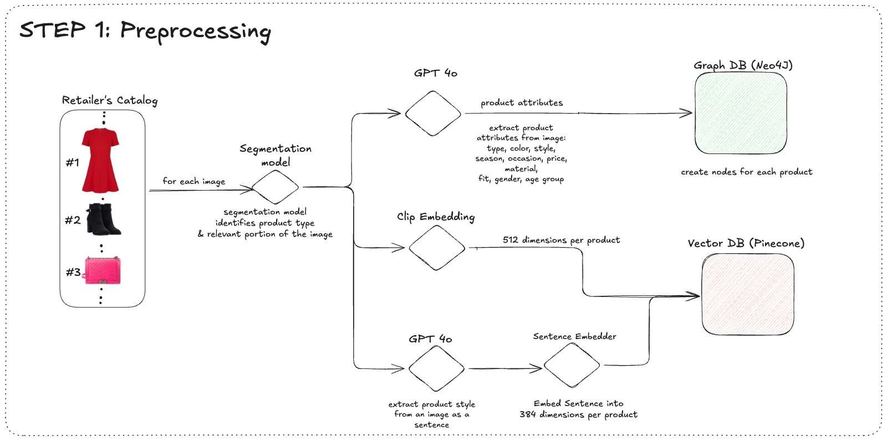
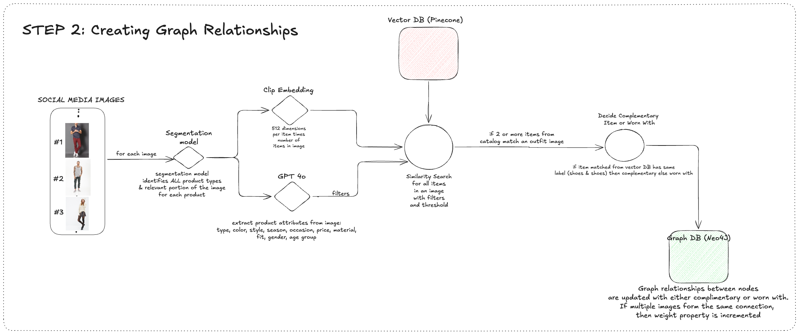

# Complete the Look - Outfit Recommendation System

This application leverages advanced image processing, knowledge graphs, and recommendation systems to provide personalized outfit recommendations. By analyzing images from social media or user uploads, the system identifies clothing items and suggests complementary products from a retailer's catalog.

## Table of Contents

- [Introduction](#introduction)
- [Features](#features)
- [Architecture Overview](#architecture-overview)
- [Installation](#installation)
- [Usage](#usage)
  - [Processing the Catalog](#processing-the-catalog)
  - [Processing Social Media Images](#processing-social-media-images)
  - [Running the Streamlit App](#running-the-streamlit-app)
- [Project Structure](#project-structure)

## Introduction

The **Complete the Look** project aims to enhance the online shopping experience by:

- Extracting clothing items from images using computer vision.
- Building a knowledge graph to understand relationships between products.
- Using vector databases for efficient similarity search.
- Providing a Streamlit dashboard for interactive recommendations.

This concept can be applied to various industries beyond fashion retail, such as interior design, automotive customization, beauty and cosmetics, and more.

The architecture diagram for preprocessing catalog data into vector database and graph database is the following:


Connections between Graph Nodes are formed using Social Media images of existing outfits that are paired together. Feeding in these social media images helps build the relationship between the products using the following workflow:




Based upon this underlying Graph Dataset, several usecases can be implemented such as Complete the Look, Find Similar Clothes based on image upload, Find similar clothes based on text description.


## Features

- **Product Attribute Extraction**: For a given input unstructured raw image such as a Garment Spec sheet, the model extracts product attributes such as product title, description, summmary, and structured attributes such as sleeve length, fit, pattern etc.
- **Product Recommendations**: This feature traverses through the knowledge graph built in step 2 to identify complementary or worn with items for a selected product based on images from social media
- **Style Match: Upload your Outfit**: This feature Segments the identified clothing products from a user uploaded image, and performs semantic search on Image Embeddings stored in Vector DB to identify similar products available in the catalog
- **Style Match: Describe your Outfit**: This feature converts the user inserted text into a style description based sentence, which is then embedded into both sentence embedder vector space as well as clip image embedder vector space. Semantic search is applied on vectors stored in both these Vector DBs respectively, and Reciprocal Rank Fusion is applied to retrieve products in the catalog that match the inserted text

## Architecture Overview

The system consists of several interconnected components:

1. **Image Processor**: Uses modular models to segment images, extract embeddings, and attributes for each clothing item.
2. **Graph Database**: Stores products and relationships using Neo4j to represent the knowledge graph.
3. **Vector Database**: Stores item embeddings for efficient similarity queries using vector search (e.g., Pinecone).
4. **Recommender System**: Combines data from the graph and vector databases to generate recommendations.
5. **Streamlit App**: Provides a user interface for interacting with the system.

## Installation

### Prerequisites

- Python 3.8 or higher
- [Poetry](https://python-poetry.org/) for dependency management
- Neo4j database instance
- Access to a vector database service (e.g., Pinecone)
- GPU (recommended for faster image processing)

### Steps

1. **Clone the Repository**

   ```bash
   git clone https://github.com/yourusername/complete-the-look.git
   cd complete-the-look
   ```

2. **Install Dependencies**

   Use Poetry to install all required packages.

   ```bash
   poetry install
   ```

3. **Set Up Environment Variables**

   Create a `.env` file in the project root directory with the following variables:

    Use `.env.template` to fill in the required environment variables

4. **Prepare the Catalog Data**

   Place your retailer's catalog CSV file in the `output/data/` directory and ensure it's named `catalog_combined.csv`. The CSV should contain at least the following columns:

   - `product_id`
   - `image_path`
   - `category` (or `type`)

5. **Initialize the Vector Database**

   Create an index in your vector database for storing embeddings. For example, using Pinecone:

   ```python
   import pinecone

   pinecone.init(api_key='your_pinecone_api_key', environment='your_environment')
   pinecone.create_index('catalog-clothes', dimension=512)  # Adjust dimension as per your embedding model
   ```

6. **Process the Catalog**

   Run the script to process the catalog and populate the databases:

   ```bash
   python src/engine/process_catalog.py
   ```

## Usage

### Processing the Catalog

Before running the application, you need to process your product catalog to generate embeddings and populate the vector and graph databases.

```bash
python src/engine/process_catalog.py
```

### Processing Social Media Images

(Optional) You can process social media images to enrich the knowledge graph with real-world outfit combinations.

```bash
python src/engine/process_social_media_images.py
```

### Running the Streamlit App

Start the Streamlit application to interact with the recommender system.

```bash
streamlit run app/main.py
```

**Features of the Streamlit App:**

- **Product Attribute Extraction**

  - Insert an raw unstructured image url to generate structured attributes
  - Overwrite the AI generated attributes manually if necessary

- **Product Recommendations**

  - Select a product from the catalog to get recommendations.
  - View products that are often worn with or complement the selected item.
  - Displays complementary worn-with products based on trends identified in social media images.

- **Style Match: Upload Your Outfit**

  - Upload an image or enter an image URL.
  - The system analyzes the outfit and finds matching products from the catalog.
  - Displays products that closely match the items in the uploaded image.

- **Style Match: Describe the outfit**

  - Enter text to describe the style of the image
  - The system converts text into style description which is queried against vector database of product style descriptions
  - Simulataneously, the text is also queried against image vector embeddings
  - Retrieved products from both sources are re-ranked and displayed to the user

## Project Structure

```
complete-the-look/
├── app/
│   └── main.py                   # Streamlit application
├── src/
│   ├── engine/
│   │   ├── image_processor.py    # Orchestrates image processing tasks
│   │   ├── process_catalog.py    # Processes the catalog data
│   │   └── process_social_media_images.py  # Processes social media images
│   ├── inference/
│   │   └── recommender.py        # Recommender system logic for inference
|   │   └── product_attributes.py # Extract attributes from unstructured image
│   ├── models/
│   │   ├── model_manager.py      # Centralized model initialization
│   │   ├── segmentation_model.py # Segmentation model class
│   │   ├── embedding_model.py    # Embedding model class
│   │   └── attribute_extraction_model.py  # Attribute extraction model class
│   ├── database/
│   │   ├── graph_database.py     # Graph database handler
│   │   └── vector_database.py    # Vector database handler
│   └── utils/
│       ├── models.py             # Data models and schemas
│       └── prompts.py            # Prompts for LLMs
├── output/
│   └── data/
│       └── catalog_combined.csv  # Catalog data file
├── temp_images/                  # Temporary images directory
├── README.md                     # Project documentation
└── .env                          # Environment variables
```


- **Databases**

  - **Neo4j**: Graph database for storing products and relationships.
  - **Vector Database**: For storing image and sentence embeddings (e.g., Pinecone).

- **Models**

  - **Segmentation Model**: Pretrained model for image segmentation (e.g., `sayeed99/segformer_b3_clothes`).
  - **Embedding Model**: Pretrained model for generating embeddings (e.g., `Marqo/marqo-fashionCLIP`).
  - **Attribute Extraction Model**: Uses Azure OpenAI's GPT-4o for extracting attributes.
  - **Style Description Generator Model**: Uses Azure OpenAI's GPT-4o for generating style description for products
  - **Sentence Embedding Model**: Pretrained embedding model for sentences (e.g., `all-MiniLM-L6-v2`)

  - **Contact** - Ashley Peedikaparambil ashley.peedikaparambil@tigeranalytics.com, Sabarish Sabarish Gopalakrishnan 
sabarish.gopalakrishnan@tigeranalytics.com